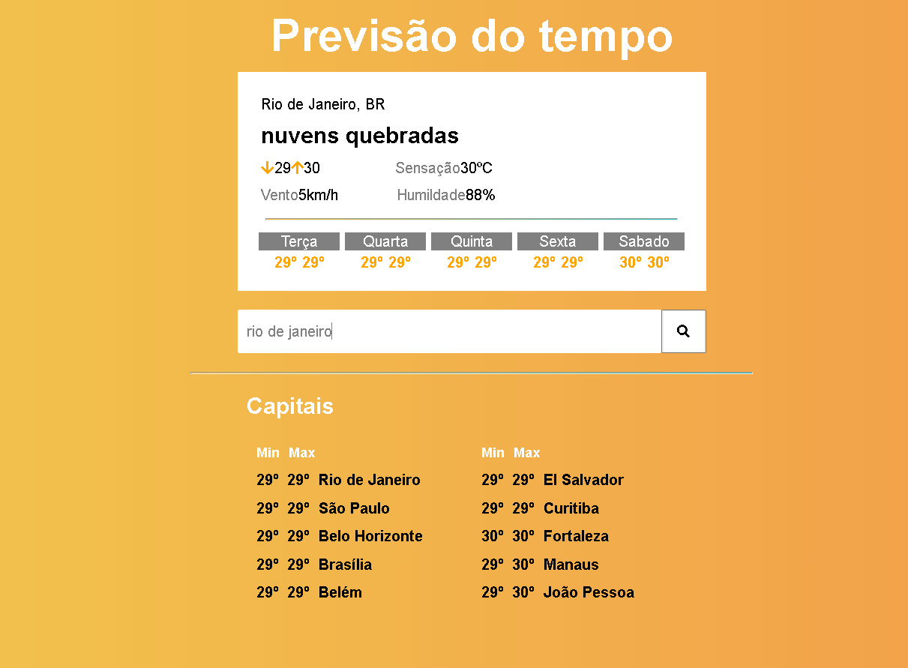

Fiquei uns dias sem programa e resolvi fazer esse projetinho pequeno pra refresca a memoria do typescript e react, também foi utilizado styled-components

Basta digita o nome da cidade que deseja procurar no input e vai exibir o resultado, se não encontrar nada exibi uma mensagem

<B>API DE PREVISÃO DO TEMPO</b>

Para rodar o projeto, o arquivo e na pasta use yarn ou npm install e depois yarn start
